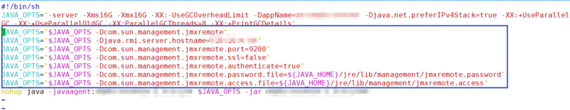
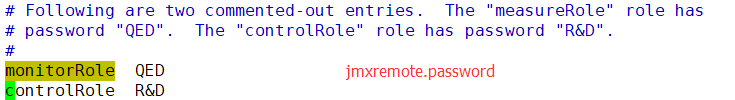
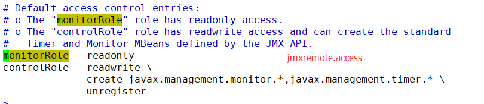
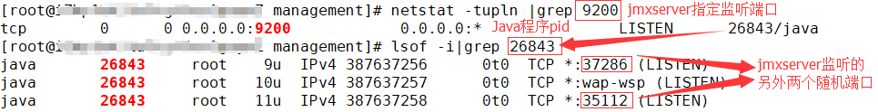
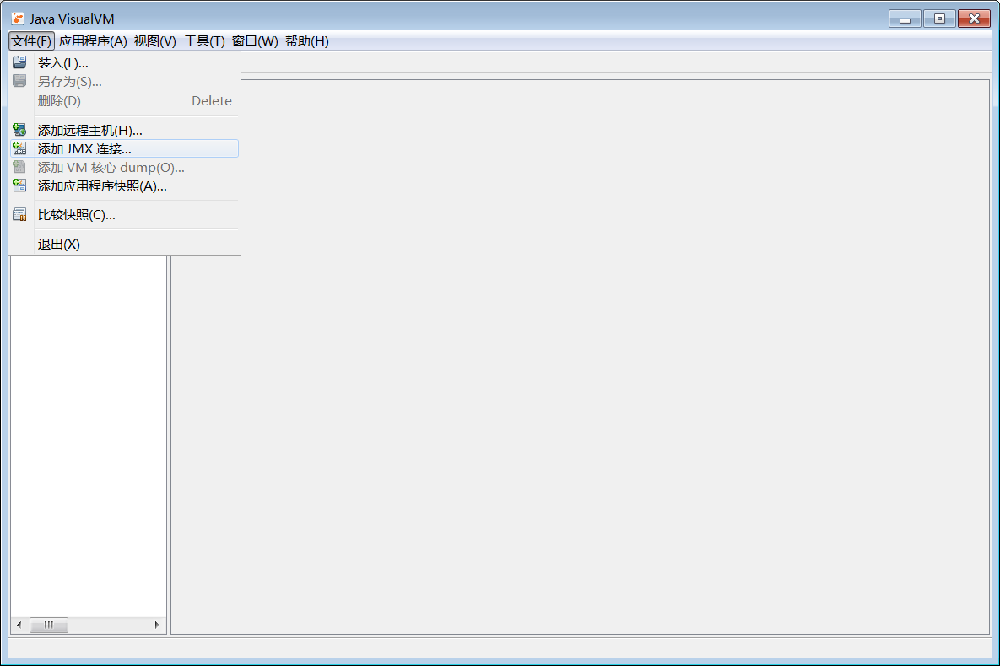
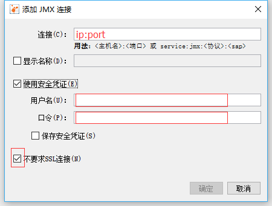
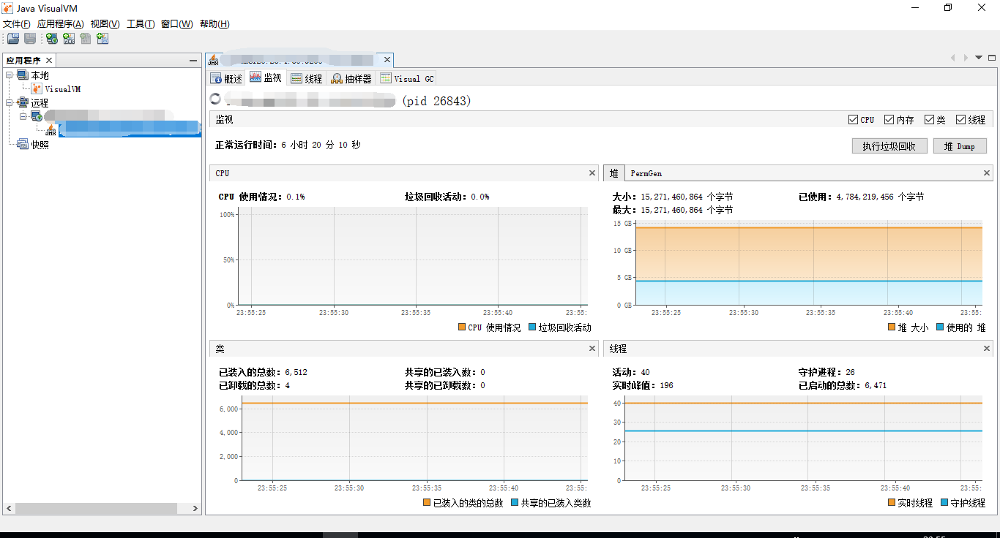

## 使用jvisualvm通过JMX的方式监控远程JVM运行状况 ##

### 1. jvisualvm介绍 
jvisualvm为jdk自带jvm性能监控工具，通过动态可视化的展示，方便监控本地及远程jvm的运行情况。监控本地jvm比较简单，本文不做介绍。jvisualvm位于$JAVA_HOME/bin/目录下。
### 2. 远程jvm参数配置
在java程序启动时加上以下jvm参数：
```
-Dcom.sun.management.jmxremote
-Djava.rmi.server.hostname=<远程服务器ip>
-Dcom.sun.management.jmxremote.port=<远程服务器端口>
-Dcom.sun.management.jmxremote.ssl=false
-Dcom.sun.management.jmxremote.authenticate=false/true
```
当-Dcom.sun.management.jmxremote.authenticate=true时，还需添加
```
-Dcom.sun.management.jmxremote.password.file=<jmxremote.password文件路径>
-Dcom.sun.management.jmxremote.access.file=<jmxremote.access文件路径>
```
### 3. 远程jvm参数配置示例

### 4. jmxremote.password和jmxremote.access配置
直接copy$JAVA_HOME/jre/lib/management/目录下的jmxremote.password.template和jmxremote.access再自定义修改，例如：


注意：由于密码是以明文的方式保存在jmxremote.password中，所以此文件只能有被其所有者都读写，即，权限为600。
### 5. 启动需要远程监控的java程序
### 6. 配置防火墙规则，解除jmxserver相关端口限制
jmxserver除了监听章节2中配置的jmxremote.port端口号外，还会监听一到两个随机端口号。两个随机端口号查看方式如下图：

**提示**：再每次重启Java程序后，jmxserver监听的随机端口都可能会发生改变，所以每次都要在防火墙中重新配置新的随机端口；建议在防火墙规则中配置随机端口为临时端口。  
[jmxserver监听的随机端口配置参考](http://qian0021514578.iteye.com/blog/2189041 "jmxserver监听的随机端口配置参考")
### 7. 本地客户端配置





