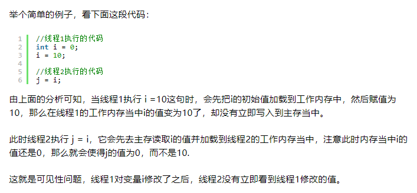

# Java内存模型
Java内存模型规定了所有的变量都存储在主内存（存储共享变量）中。每条线程中都还有自己的工作内存，线程的工作内存中保存了该线程所使用到的变量（共享变量的副本）。线程对变量的所有操作（读取、赋值）都必须在工作内存中进行。不同线程之间无法直接访问对方工作内存中的变量，线程之间变量值的传递必须通过主内存来完成。

# 操作原子性
对于基本数据类型的变量的读取、赋值是原子性操作的，即这两个操作都是不可以被打断的。但是，java内存模型只保证了基本数据类型的变量的读取、赋值是原子性操作，如果要实现更大范围的原子性操作，可以通过synchronized或lock来实现。

# 变量可见性
当多个线程访问同一个共享变量时，某一个线程修改了这个共享变量的值，其它线程能够立即看到修改后的值。java可以使用volatile修饰共享变量，以保证共享变量的可见性。当一个共享变量被volatile修饰时，它会保证修改的值会立即从线程工作内存写回主内存，并使其它线程工作内存中的该变量缓存失效，当其它某个线程再次使用该变量时发现自己工作内存中的缓存已失效，它会等待缓存行对应的主存地址被更新之后，然后去对应的主存读取最新的变量值。

# 指令有序性
在java内存模型中，允许编译器和处理器对指令进行重排，但是指令重排不会影响到单线程的运行结果，却会影响到多线程并发运行的正确性。可以通过volatile关键字来保证一定的“有序性”。另外可以通过synchronized和Lock来保证有序性，很显然，synchronized和Lock保证每个时刻是有一个线程执行同步代码，相当于是让线程顺序执行同步代码，自然就保证了有序性。

# Volatile 关键字的作用
Volatile关键字可以保证被其修饰的共享变量（类成员变量、类静态成员变量）具有【可见性】和【有序性】，但是不能保证具有【原子性】。

# Volatile关键字和synchronized的区别
synchronized关键字是防止多个线程同时执行一段代码，那么就会很影响程序执行效率，而volatile关键字在某些情况下性能要优于synchronized，但是要注意volatile关键字是无法替代synchronized关键字的，因为volatile关键字无法保证操作的原子性。

[摘自](http://www.importnew.com/24082.html)