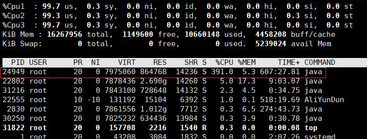
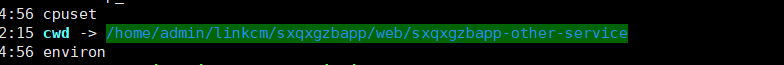
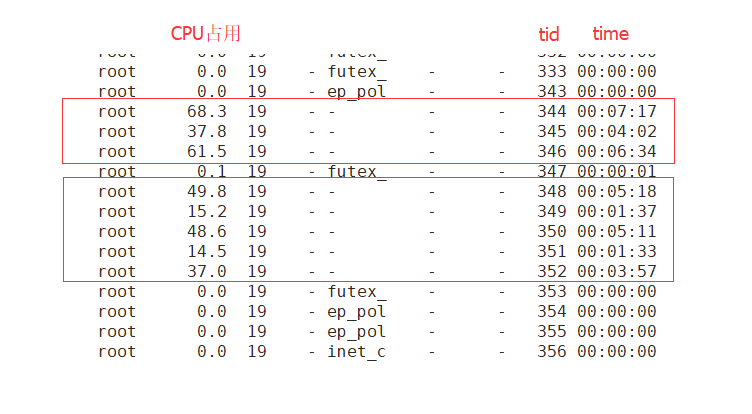
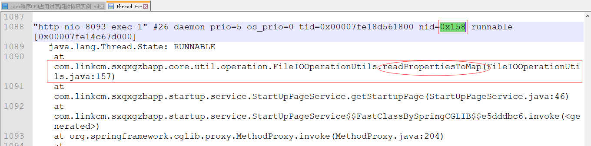
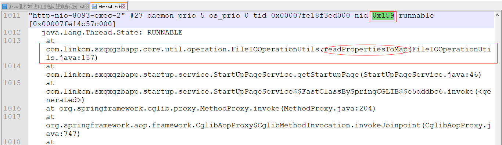
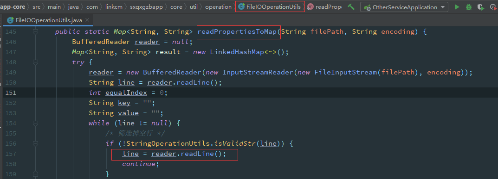

# 1 背景
运维同事反馈监控到生产环境服务器CPU占用很高
# 2 问题解决
## 2.1 定位异常进程PID
使用top命令查看CPU占用情况

## 2.2 查看异常进程对应的程序
执行命令 `cd /proc/PID` (PID需要换为具体的异常进程ID)，可以查看cwd和exe

经查看，定位到占用CPU较高的是sxqxgzbapp-other-service（跟源码排查问题需要用到）
## 2.3 定位异常线程
执行命令`ps -mp PID -o THREAD,tid,time`查看线程信息

经查看，定位到ID为344、345、346、348、349、350、351、352的8个线程占用CPU较高，并且都已经运行了一段时间
## 2.4 将异常线程ID转换为十六进制
将异常线程ID转为16进制，方便后续在jstack中快速定位查找；转换为十六进制的异常线程ID为0x158、0x159、0x15a、0x15c、0x15d、0x15e、0x15f、0x160
## 2.5 查看异常进程详细信息
执行命令`jstack PID > thread.txt`，将占用CPU较高进程信息写入thread.txt文件中
## 2.6 在进程信息中查找异常线程信息

## 2.7 跟源码排查问题

备注：问题可以在生产环境服务器上复现，但是本地未能复现;初步怀疑和代码中读取的文件内容乱码有关系(检查代码中读取的文件，发现内容中有乱码，解决掉乱码后恢复正常)

[传送门](https://blog.csdn.net/puhaiyang/article/details/78663942)

