# 1 安装zookeeper 3.4.9

## 1.1 下载zookeeper镜像
`docker pull zookeeper:3.4.9`

## 1.2 启动镜像
`docker run -it -d --name zookeeper -p 2181:2181 zookeeper:3.4.9`

## 1.3 检查启动是否成功
使用以下命令查看zookeeper是否启动成功  
`docker ps | grep zookeeper `

# 2 安装Mysql

## 2.1 获取saturn-db.zip（由平台技术部人员提供）

## 2.2 解压saturn-db.zip
新建saturn-db目录，将压缩包放入，解压  
`unzip saturn-db.zip`
解压得到的三个文件如下图:  
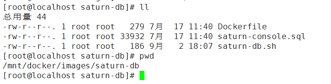

## 2.3 创建saturn-db镜像  
`docker build -t saturn-db:latest .`

## 2.4 启动saturn-db容器
`docker run -d --name saturn-db -p 3306:3306 -v /mnt/docker/container/saturn-db/mysql/config/conf.d:/etc/mysql/conf.d -v /mnt/docker/container/saturn-db/mysql/data:/var/lib/mysql -e MYSQL_ROOT_PASSWORD=root saturn-db`

## 2.5 验证mysql启动成功
利用mysql相关信息登录，看到saturn_console数据库，如下图所示，即安装成功  
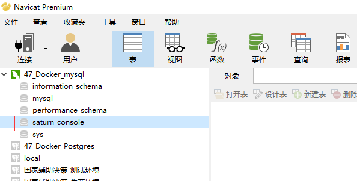  
***如果成功连接了数据库服务，但是没有saturn_console数据库，则手动执行下saturn-console.sql即可。***

# 3 安装saturn-console

## 3.1 获取saturn-console.zip（由平台技术部人员提供）

## 3.2 解压saturn-console.zip
新建saturn-console目录，将压缩包放入，解压  
`unzip saturn-console.zip`
解压得到的两个文件如下图:  
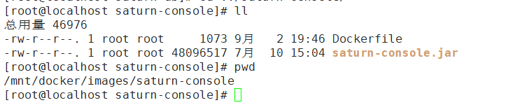

## 3.3 安装saturn-console镜像
`docker build -t saturn-console .`

## 3.4 启动saturn-console容器
`docker run -it --name saturn-console -d -p 9088:9088 --link saturn-db:db -e DB_URL="jdbc:mysql://db:3306/saturn_console?useUnicode=true&characterEncoding=UTF-8" -e DB_ROOT="root" -e DB_PASSWORD="root" -v /mnt/docker/container/saturn-console/logs:/apps/logs -v /etc/localtime:/etc/localtime:ro saturn-console`

## 3.5 验证saturn-console是否启动成功
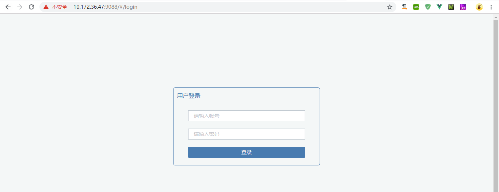

## 3.6 saturn-console配置
saturn-console成功启动后，需要在页面做一些基本的配置，以保证后面executor的正常启动

### 3.6.1 配置zookeeper
进入"注册中心"->"zk集群管理"->"添加集群",配置有效的zookeeper  
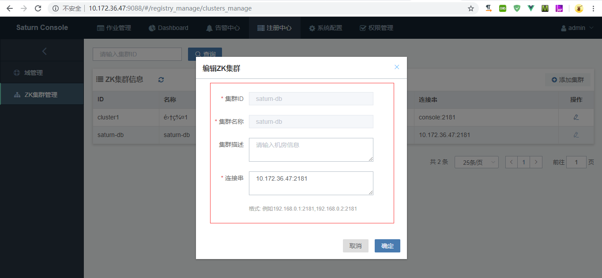
刷新页面即可看到配置的zookeeper在线  
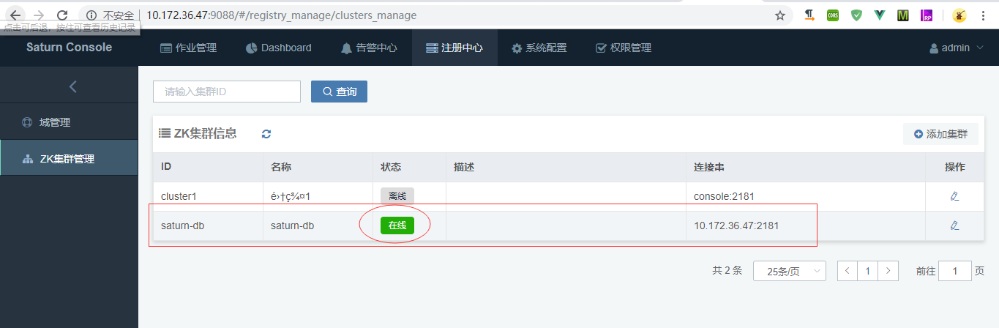

### 3.6.2 配置域名
 进入"注册中心"->"域管理"->"添加域"  
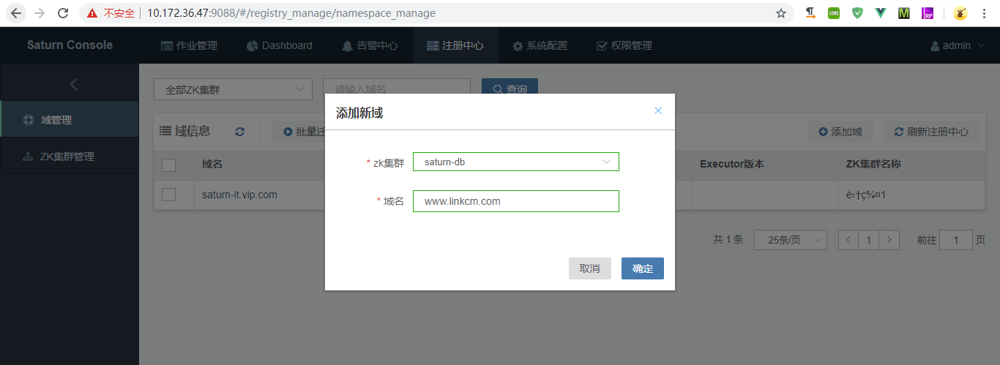
配置后的域如图  
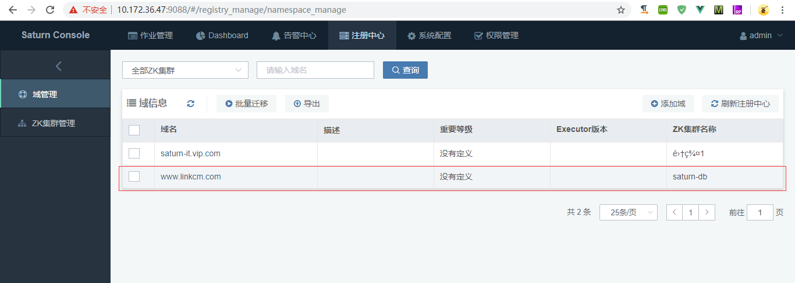

### 3.6.3 设置saturn-console与zookeeper映射
进入"系统配置"->"console配置"->"ZK集群配置"  
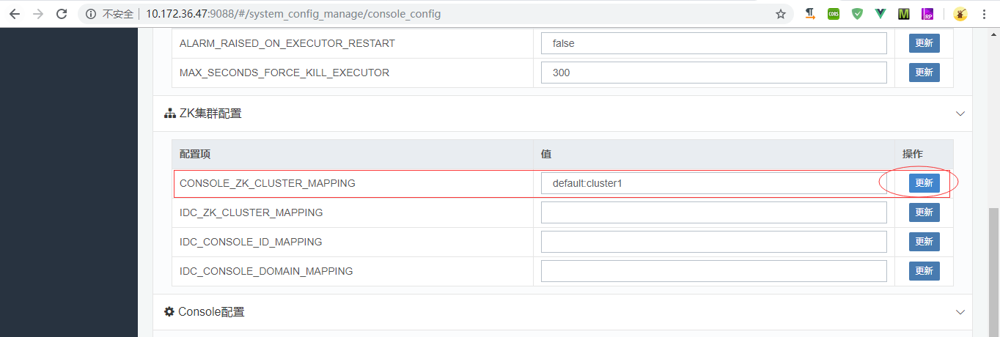  
点击后更新后，不会立即生效，需要等待刷新

# 4 安装saturn-executor

## 4.1 获取saturn-executor.zip（由平台技术部人员提供）

## 4.2 解压saturn-executor.zip
新建saturn-executor目录，将压缩包拷入，执行解压命令  
`unzip saturn-executor.zip`  
解压后的2个文件如图所示:  
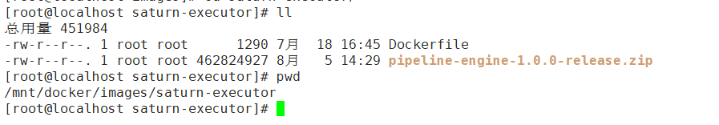

## 4.3 安装saturn-executor镜像
`docker build -t saturn-executor:latest .`

## 4.4 启动saturn-executor容器
`docker run -it --name saturn-executor --link saturn-console:console -e CONSOLE_RUI=http://console:9088 -e NAMESPACE=www.linkcm.com -e EXECUTOR_NAME=pipelineAgent -v /mnt/docker/container/saturn-executor/logs:/apps/saturn/pipeline-engine-1.0.0/logs saturn-executor`  
***注意：启动executor之前，必须保证console已启动，且已存在对应的域，如www.linkcm.com;若不存在，则应先添加域，再启动executor，否则会造成executor启动出错或console页面不能显示executor***

## 4.5 验证saturn-executor成功
在console页面看到如下信息，说明saturn-executor启动成功  
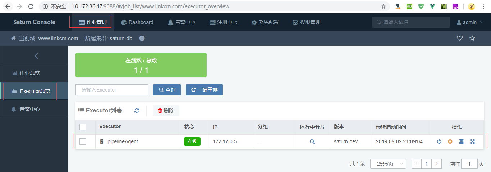